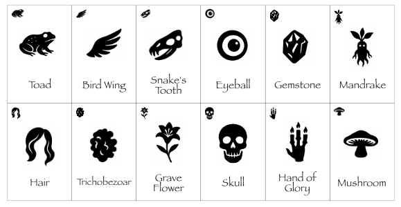
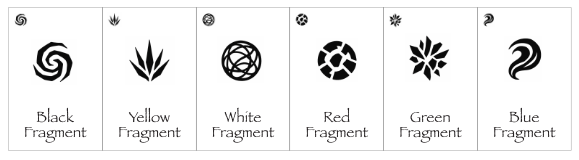
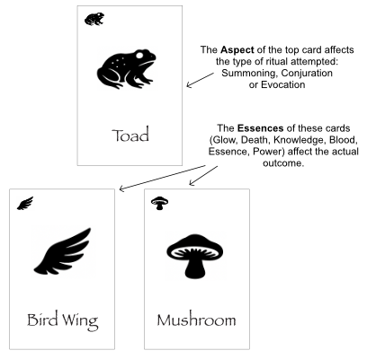

# The Illuminated

## How to play

The Illuminated board game features a number of gameplay aspects, but a core part of the gameplay loop relevant to this app is players regularly attempting to discover spells by combining ingredients. 

In each new game, the elements of the 12 ingredients are randomly and secretly alloted, meaning players must experiment and deduce how the current set of ingredients work.

## The ingredients

Each game features the same 12 base ingredients and 6 fragments. (Note that this AI-generated placeholder art will be replaced with human-made art in the course of game development.)

## Aspects and Essences

Each ingredient is assigned two elements: 
- a ritual Aspect (Summoning, Conjuration or Evocation) 
- an Essence (Blood, Glow, Death, Essence, Knowledge, Power). 

Since there are 12 ingredients, there are always two ingredients for each Essence. 

Each of the 6 fragments correspond to different Essences, also randomly assigned each game. 

## Discovering rituals

When a player takes a Ritual Experimentation action, they arrange 3 of their ingredients in a triangle shape.

The **Aspect** of the top ingredient determines the type of ritual being attempted: Summonging, Conjuration or Evocation.

The combined **Essences** of the bottom two ingredients determine the actual spell that is discovered, if any, as according to this diagram:

## The benefits (and hazards) of experimentation

These are the possible outcomes of ritual experimentaiton: 

**Success**
 The two Essences are a legitimate combination, resulting in the discovery of a new ritual.

**Combine**
 Two idential Essences will combine to form a fragment – a more enduring form of that essence.

**Corruption**
 Two opposed Essences will react to corrupt the experimenter.

**Fizz**
 If none of the above results apply, the ritual experiment fizzes with no result.

